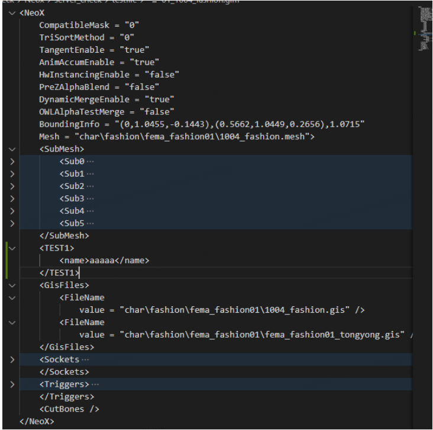

Nexo Rule Field Description
The rule fields for the Nexo inspection module can be divided into three categories: file type determination, key data extraction, and conditions that data must satisfy. The fields used are as follows:

Field | Chinese | Name | Data | Type | Description | Example	
name | Name | str | Rule name | | 
xpath | Path | str | Path to extract key data from within resource files; extracted content is stored in a list | If data = {'a':{'b':1,'c':2},'d':{'b':3,'c':4}} and we want to extract values with key b, then xpath='data/a/b' or xpath='*/a/b' will extract data as [1,3] |
filter | Filter | str | Converts or filters data extracted via xpath; supports regular expressions or custom functions | When filter is of type str, re.match(filter,d) will be used, where d is each individual extracted data point. For example, if data is ["abcd-1223", "0000-1223"], filter='0000-.*' can be used to filter, resulting in only ["abcd-1223"] being checked |
not_filter | Reverse Filter | str | Reverse filter for resource files | | 
condition | Condition | list | Conditions that key data must satisfy. Key data will be iterated over, with each piece of data treated as variable d. Built-in operations include: exists, exists in, does not exist, does not exist in, satisfies expression, multi-file association, exists in inspection directory | See supplementary notes |
only_name | Only Take Filename | bool | Use filename as key data | | 
rpath | Regex Path | str | Regular expression path; matches resource files that satisfy the regex. Uses re.match(rpath, file_path) for regex matching | | 
not_rpath | Reverse Regex Path | str | Reverse regex path; if a match fails, the file will be inspected using this rule. Opposite function of rpath | | 
subxpath | Secondary File Keyword Path | str | Keyword path within secondary files; used when cross-referencing files. When xpath extracts data that is a filename, and we need to inspect the contents of these files, subxpath can be used to extract again. Format is consistent with xpath | | 
subfilter | Secondary Filter | str | Secondary filter, same as filter | | 
ignor | Whether to Include in Inspection | str | Whether to include in inspection | | 
desc | Description | str | Description | | 
func_str | Additional Function | str | Additional function; custom function for the filter | See supplementary notes | 

Supplementary Notes
Condition Examples: The types supported by condition include: exists, exists in, does not exist, does not exist in, satisfies expression, and exists in inspection directory. Reference syntax:

['exists']

['does not exist']

["exists in", "../../../../Char/ "] — indicates existence within a specific path

["satisfies expression", "d == 'PBR_Foliage'"] — d is the iterated single value from the data extracted via xpath. For example, if xpath extracts ['PBR_Foliage', 'PBR_Foliage2'], then d will be PBR_Foliage and PBR_Foliage2 respectively.

Filter fun_str Data Filtering Example: Filtering out data starting with "0000". Function implementation:

```
python
def filter_zero(**pdata):
    ret = []
    data = pdata.get("data", [])
    for d in data:
        if d.startswith("0000-"):
            continue
        ret.append(d)
    return ret
```

Rule Writing Examples
Nexo primarily inspects two types of file formats: XML format and binary format. Binary resource files include mesh, gis, png, dds, bmp, tga, jpg files, etc. XML resource files include scn, gim, sfx, mtg files. Binary file rules are more specialized, with each file type having its own set of definitions. XML files are more universal, and specific key data can be obtained through XML parsing.



Using a gim file as an example (as shown in the figure), here are basic rule examples:

Example 1: Submesh count in gim files cannot exceed 5 (reading DOM elements)
Step 1: Need to filter out gim files. Therefore, fill in rpath with a regular expression: .*gam$ to filter files with the matching extension.

Step 2: Need to locate the SubMesh attributes in the gim file. Since gim files are generated in XML format, we need to find all SubMesh attributes using */SubMesh.{dom}. In the figure, there is 1 SubMesh, with each SubMesh having 5 child attributes.

Step 3: Determine whether the extracted key data satisfies the condition. The extracted attributes will be placed in data=[]. Since the rule requires the count not to exceed 5 and must be satisfied for each SubMesh, the rule will iterate through the data, with each piece of data as variable d. Therefore, we only need to define the rule as: ["satisfies expression", "len(d) <= 5"]

Example 2: gim associated file inspection (reading attribute values)
Step 1: Still need to filter out gim files. Fill in rpath with the regular expression: .*gam$

Step 2: Read attribute values using fuzzy matching to locate the attribute we care about — FileName. Use */*/FileName:value to obtain the value under the FileName attribute.

Step 3: The obtained value is a path address. You can use custom filters to modify the data as needed, or use subxpath for secondary filtering.

Example 3: gim file value extraction (values under tags)
Step 1: Filter gim files. Fill in rpath with the regular expression: .*gam$

Step 2: To obtain the value under name within TEST1, use */TEST1.name to get the corresponding value: data=['aaaaa']

Step 3: Define custom rule conditions based on the obtained values.