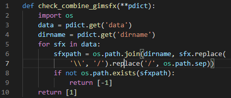

Tradução para PT-BR

1. Leitura de elementos DOM do XML
nome: O número de submeshes no arquivo gim não pode ser maior que 5
xpath: */SubMesh.{dom}
condition: ['satisfaz expressão', 'len(d) <= 5']
rpath: .*gim$

Descrição da regra:

rpath: .*gim$ - Filtra arquivos que correspondem à expressão regular. Na prática, a execução realiza a filtragem de arquivos em todo o diretório de verificação usando re.match(rpath, caminho_do_arquivo). Arquivos que atendem à condição continuam o processo.

xpath: */SubMesh.{dom} - Extrai dados importantes do arquivo. O formato do arquivo XML é conforme mostrado na imagem. SubMesh está no segundo nível. */SubMesh aponta para a tag. Alternativamente, pode-se usar root/SubMesh para filtrar. Para extrair elementos DOM, utiliza-se o método fixo .{dom}, obtendo todos os nós sob SubMesh. Na imagem, os dados dos nós extraídos via xpath formam data=[]. Se houver 2 SubMeshes, então data = [nó1, nó2].

condition: ['satisfaz expressão', 'len(d) <= 5'] - Para a lista de dados obtida, a condição preenchida é aquela que cada item individual da lista precisa satisfazer. Na imagem, o número de nós filhos de SubMesh é 5, atendendo à condição da regra.

2. Leitura de valores de atributos XML e método de filtragem de arquivos secundários
nome: Verificação de arquivos associados no gim (leitura de valores de atributos)
rpath: .*gim$
xpath: */*/FileName:value
filter: artfunc_check_combine_gimsfx
condition: ['satisfaz expressão', 'len(d) > 0']
func_str: 

Descrição da regra:

rpath: .*gim$ - Filtra arquivos gim

xpath: */*/FileName:value - Lê valores de atributos. Pode-se usar correspondência difusa para localizar o atributo desejado (FileName). FileName:value obtém o valor do atributo sob FileName. Como os dados obtidos são um endereço de arquivo, existem duas formas de realizar a análise secundária desses endereços. Neste caso, optou-se por usar filter.

filter: artfunc_check_combine_gimsfx - Ao preencher o filter com uma função personalizada, é possível realizar a análise secundária dos dados obtidos. O objetivo aqui é verificar se o arquivo associado existe no diretório atual. Se não existir, a regra não é aprovada.

3. Valores de tags em arquivos XML
nome: Extração de valores em arquivos gim (valores sob tags)
rpath: .*gim$
xpath: */TEST1.name
condition: ['satisfaz expressão', 'len(d) > 1']

Descrição da regra:

rpath: .*gim$ - Filtra arquivos gim

xpath: */TEST1.name - Para obter o valor de name dentro de TEST1, utiliza-se */TEST1.name, que retorna o valor correspondente

condition: ['satisfaz expressão', 'len(d) > 1'] - Define condições personalizadas com base nos valores obtidos