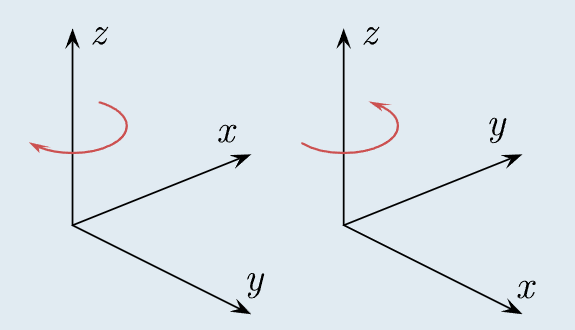

# Background Knowledge of Bone Stuffs

Guess it's better to start a separate thread for this, for the sake of management.
Join with the in-depth discussion of parsing bone data here.



Here I'll list all the knowledge I've got so far, and it might be extended in the future. Of course, any advice/feekback is welcome.
**Coordinate System:**
There're two Cartesian coordinate systems for describing the physical world in the field of computer graphics, which're known as the right-handed and the left-handed coordinate system.

[Image]

The left-handed orientation is shown on the left, and the right-handed on the right.
An object in a left-handed coordinate system would appear mirrored in the right-handed coordinate system, but they should be the same object to the physical world, so you'll need to convert its coordinates from one to the other system your 3D app is using. For static objects, it can be achieved by changing the sign of the coordinates of any one of the 3 axies, or by swapping any two of the 3 axies. But the former way won't affect the orientation of the rotation so it doesn't work for converting a left-handed skeleton to a right-handed one.

**Representation of Bone:**
Basically bones are merely a set of nodes containing linking and transformation info. When nodes are linked from one to another, they form a tree structure called a skeleton. Bones are assigned with unique IDs and names so that they can be referred and linked to other bones.
Transformation is described as translation, rotation and scaling. Translation defines the position of a node, while rotation defines the orientation of this node, and scaling can affect the size of the mesh bound to this node. Depending on the reference coordinate system the bone format uses, it results in the concept of world space and parent space.
If bones are referenced to world space, the rotation info of a parent bone does not influence the position of its child, but it does if they're referenced to parent space.

So far there're 3 ways to represent rotation, that is, Euler angle, rotation matrix and quaternion.
- Euler angle: rotation angles along X, Y and Z axis in degrees.
- Rotation matrix: the position of a point after application of rotation can be calculated by multiplying its original positions represented as a column vector, with a 3x3 rotation matrix.
The rotation matrix of rotating along X, Y, or Z axis by Rx, Ry, and Rz degrees is respectively as
```
Code: Select all

Mx =
[ 1		0		 0       ]
[ 0		cos(Rx)		-sin(Rx) ]
[ 0		sin(Rx)		 cos(Rx) ]

My =
[ cos(Ry) 	0		sin(Ry) ]
[ 0 		1		0       ]
[ -sin(Ry)	0		cos(Ry) ]

Mz =
[ cos(Rz)	-sin(Rz)	0 ]
[ sin(Rz)	cos(Rz) 	0 ]
[ 0		0		1 ]
```
For different orders how the rotation are performed, the result of the matrix can also be different.
So altogether there're 6 rotation orders: XYZ, XZY, YZX, YXZ, ZXY and ZYX.
Note that the multiplication are performed in an opposite order so for rotation order XYZ the final rotation matrix Mr = Mz * My * Mx.
- Quaternion: an alternative to Euler angles and rotation matrices, and doesn't result in gimbal lock.
Usually you need to convert quaternion to Euler angle/rotation matrix or rotation matrix to Euler angle to make use of the info properly.

**Transform matrix:**
If rotation is defined as matrix, it can also be combined with the translation and scaling info and be stored as a 3x4/4x4 matrix.
Say the translation vector to be [Tx Ty Tz]',
the scaling matrix to be
```
Code: Select all

[Sx 0 0]
[0 Sy 0]
[0 0 Sz]
```

the rotation matrix to be
```
Code: Select all

[R11 R12 R13]
[R21 R22 R23]
[R31 R32 R33]
```
the 3x4 transform matrix can be represented as
```
Code: Select all

[	[R11 R12 R13]   [Sx 0 0]			Tx	]		 [ R11*Sx, R12*Sx, R13*Sx, Tx ]
[	[R21 R22 R23] * [0 Sy 0]			Ty	]	=	 [ R21*Sy, R22*Sy, R23*Sy, Ty ]
[	[R31 R32 R33]   [0 0 Sz]			Tz	]		 [ R31*Sz, R32*Sz, R33*Sz, Tz ]
```
or in the form of a 4x4 matrix:
```
Code: Select all

[ R11*Sx, R12*Sx, R13*Sx, Tx ]
[ R21*Sy, R22*Sy, R23*Sy, Ty ]
[ R31*Sz, R32*Sz, R33*Sz, Tz ]
[ 0	, 0	, 0	, 1  ]
```

**Linear Storage of Matries:**
Mathematically we read a matrix by row from left to right, but when it is stored in memory as a linear array, it results in two different orders of storing the elements.
- Row-major order: elements stored by row.
- Column-major order: elements stored by column.

[Image]

'''**wikipedia wrote:**
As exchanging the indices of an array is the essence of array transposition, an array stored as row-major but read as column-major (or vice versa) will appear transposed.'''


# Approaches of Parsing Bone Representations

As far as I know, bones are a set of linked nodes with transformation info includes translation, rotation and scaling, and due to the various representations of rotation, there're mostly 3 forms of representing a bone: Euler angle, rotation matrix and quaternion combined with the rest transformation.

Recognizing these forms is not a big deal, but parsing them correctly is. Therefore I decided to create a thread for an in-depth discussion of the common approaches of parsing different forms of bone representations, hopefully to give those who have only a scanty knowledge to this topic, me included, a hint of parsing a specific bone format.

For those who're completely new to these stuffs, you can refer to the Background/Basic Knowledge for a rough understanding.

Since I'd like to focus on parsing bones correctly, I will use minimum dumps of bone data only as samples, and a quick approach to build the skeleton, which in my case would be SkelBuilder — a lightweight ASCII FBX creator I made for constructing skeleton only, after countless failures with Noesis. Guess I may also post the Noesis python code to see if someone could spot the issues. But any other approaches are fine, so long as it's easy for understanding the process.

Source of SkelBuilder(Bone data not included).
- SkelBuilder_VS2015.zip
There're several working demonstrations in the source so I'm not exploring the usage here.

**Quick entrance:**
- Right-Handed System
- - - Quaternion Rotation
- - - - Asphalt 8: Airborne (Android)
- - - - Asphalt 9: Legends (Android)
- - - - GuJian3 (PC)
- - - - Ben 10 Ultimate Alien: Cosmic Destruction (Xbox 360)
- - 3x3 Matrices
- - - - Ben 10 Omniverse (Xbox 360)
- - 3x4 Matrices
- - - - Ben 10 Omniverse 2 (3DS)
- - - - 4x4 Matrices
- Left-Handed System
- - - Quaternion Rotation
- - - - Assalt Fire (PC)
- - - - James Cameron's AVATAR THE GAME (PC)
- - - - League of Angels III (Browser)
- - 3x3 Matrices
- - - - Star Wars: Episode III – Revenge of the Sith (Xbox)
- - 4x4 Matrices
- - - - Iron Man 2 (PS3)
- - - - Cyber Hunter (Android)
- - - - IDOLM@STER One For All (PS3)

**Conclusion:**
So far, seems there's no extra things needed to do for right-handed formats. For left-handed formats, you'll need to convert the transformation in world space of every node to right-handed one. In some circumstances, swapping the x-z axis can do the trick.

# Examples

## Continue

Think I'll start with a few working examples first. :D
car_pagani_huayra.zip
```
Code: Select all

# Dump Name: car_pagani_huayra.pig
# From Game: Asphalt 8: Airborne
# Platform: Android
# Bone Format: Quaternion Rotation, Translation
# Coordinate System: Right-Hand
# Endian: Little
```

**Bone data structure:**
```
Code: Select all

long	Signature
word	boneCount
for i = 0 < boneCount
	long	Signature
	word	nameLen
	char	boneName[nameLen]
	char	Zero
	short	parentID
	float	Translation[3]
	float	Rotation[4] // Quaternion Rotation
	float	Scaling[3]
	char	NULL[6]
```
Very simple format and since it's already in right-handed system, you don't even need to worry about the convertion between different coordinate systems.
Transformation is referenced to parent space so just need to convert quaternion to Euler angle. It's even working with Noesis.

[Image]

**Noesis python code:**
```
Code: Select all

#load the model
def noepyLoadModel(data, mdlList):
	bs = NoeBitStream(data)
	boneCount = bs.readUShort()
	bones = []
	for i in range(0, boneCount):
		bs.seek(4, NOESEEK_REL)
		NameLen = bs.readUShort()
		boneName = noeStrFromBytes(bs.readBytes(NameLen), "ASCII")
		bs.seek(1, NOESEEK_REL)
		bonePIndex = bs.readShort()
		Tran = NoeVec3.fromBytes(bs.readBytes(12))
		Rot = NoeQuat.fromBytes(bs.readBytes(16))
		Scal = NoeVec3.fromBytes(bs.readBytes(12))
		bs.seek(6, NOESEEK_REL)
		boneMat = Rot.toMat43(transposed = 1)
		boneMat[3] = Tran
		bones.append( NoeBone(i, boneName, boneMat, None, bonePIndex) )
	# Converting local matrix to world space
	for i in range(0, boneCount):
		j = bones[i].parentIndex
		if j != -1:
			bones[i].setMatrix( bones[i].getMatrix() * bones[j].getMatrix() )
			
	mdl = NoeModel()
	mdl.setBones(bones)
	mdlList.append(mdl)
	rapi.setPreviewOption("setAngOfs", "-90 0 0")
	return 1
```
## Continue

Similiar format like Asphalt 8.
Genty_Akylone_car.json.zip
```
Code: Select all

# Dump Name: Genty_Akylone_car.jmodel
# From Game: Asphalt 9: Legends
# Platform: Android
# Bone Format: Quaternion Rotation, Translation
# Coordinate System: Right-Hand
# Engine: Jet Engine
# Endian: Little
```
**Bone data format:**
```
Code: Select all

byte	Skip1[0x11]
long	boneDataOffset
word	boneCount
byte	Skip2[0x1C]
for i = 0 < boneCount
	word	nameLen
	char	boneName[nameLen]
	short	parentID
	float	Translation[3]
	float	Rotation[4] // Quaternion Rotation
	float	Scaling[3]
	word	NULL
```

[Image]

**Noesis python code:**
```
Code: Select all

#load the model
def noepyLoadModel(data, mdlList):
	bs = NoeBitStream(data)
	bs.seek(0x11, NOESEEK_ABS)
	boneOffset = bs.readUInt()
	boneCount = bs.readUShort()
	bs.seek(boneOffset, NOESEEK_ABS)
	bones = []
	for i in range(0, boneCount):
		NameLen = bs.readUShort()
		boneName = noeStrFromBytes(bs.readBytes(NameLen), "ASCII")
		bonePIndex = bs.readShort()
		Tran = NoeVec3.fromBytes(bs.readBytes(12))
		Rot = NoeQuat.fromBytes(bs.readBytes(16))
		Scal = NoeVec3.fromBytes(bs.readBytes(12))
		bs.seek(2, NOESEEK_REL)
		boneMat = Rot.toMat43(transposed = 0)
		boneMat[3] = Tran
		bones.append( NoeBone(i, boneName, boneMat, None, bonePIndex) )
	# Converting local matrix to world space
	for i in range(0, boneCount):
		j = bones[i].parentIndex
		if j != -1:
			bones[i].setMatrix( bones[i].getMatrix() * bones[j].getMatrix() )
			
	mdl = NoeModel()
	mdl.setBones(bones)
	mdlList.append(mdl)
	rapi.setPreviewOption("setAngOfs", "0 0 180")
	return 1
```

## Continue

VenomSkel.zip
```
Code: Select all

# Dump Name: VenomSkel.AFM
# From Game: Assalt Fire
# Platform: PC
# Bone Format: Quaternion Rotation, Translation
# Coordinate System: Left-Hand
# Engine: Unreal Engine
# Endian: Little
```
**Bone data structure:**
```
Code: Select all

long	boneCount
for i = 0 < boneCount
	long	boneNameIdx // Indexing to original string buffer
	long	NULL
	long	NULL
	float	Rotation[4] // Quaternion Rotation
	float	Translation[3]
	long	Unknown
	long	parentID
	long	Marker // FFFFFFFF
for i = 0 < boneCount
	string	boneName	// Mapping to bone[i]
```
Unreal Engine use left-handed system so need to flip the XZ-axis to fit with right-handed system. Transformation is also in parent space.

[Image]

Noesis code works now thanks to shakotay2's correction(lack convertion to right-handed though):
```
Code: Select all

#load the model
def noepyLoadModel(data, mdlList):
	bs = NoeBitStream(data)
	boneCount = bs.readUInt()
	bs.seek(boneCount * 0x34, NOESEEK_REL)
	boneNames = []
	for i in range(0, boneCount):
		boneNames.append(bs.readString())
	bs.seek(0x4, NOESEEK_ABS)
	bones = []
	for i in range(0, boneCount):
		bs.seek(12, NOESEEK_REL)
		Rot = NoeQuat.fromBytes(bs.readBytes(16))
		Tran = NoeVec3.fromBytes(bs.readBytes(12))
		bs.seek(4, NOESEEK_REL)
		bonePIndex = bs.readInt()
		if bonePIndex == i:
			bonePIndex = -1
		bs.seek(4, NOESEEK_REL)
		boneMat = Rot.toMat43(1)
		boneMat[3] = Tran
		bones.append(NoeBone(i, boneNames[i], boneMat, None, bonePIndex))
	# Converting local matrix to world space
	for i in range(0, boneCount):
		j = bones[i].parentIndex
		if j != -1:
			bones[i].setMatrix( bones[i].getMatrix() * bones[j].getMatrix() )
	mdl = NoeModel()
	mdl.setBones(bones)
	mdlList.append(mdl)
	rapi.setPreviewOption("setAngOfs", "0 90 0")
	return 1
```

## Continue

CHAR_Bloxx.zip
```
Code: Select all

# Dump Name: CHAR_Bloxx.ve2
# From Game: Ben 10 Omniverse
# Platform: Xbox 360
# Bone Format: 3x3 Matrices, Translations
# Coordinate System: Right-Hand
# Engine: Vicious Engine 2
# Endian: Big
```
**Bone data structure:**
```
Code: Select all

long	boneCount
for i = 0 < boneCount
	long	parentID
	float	Translation[3]
	float	Rotation[3][3]
	long	nameLen
	char	boneName[nameLen]
	long	Unknown
```
The 3x3 rotation matries are in column-major order so need to transpose them before converting to Euler angles.

[Image]

Noesis code works now thanks to shakotay2's correction:
```
Code: Select all

#load the model
def noepyLoadModel(data, mdlList):
	bs = NoeBitStream(data, NOE_BIGENDIAN)
	boneCount = bs.readUInt()
	bones = []
	for i in range(0, boneCount):
		bonePIndex = bs.readInt()
		Matrix = []
		for j in range(0, 12):
			Matrix.append(bs.readFloat())
		boneMat = NoeMat43( [(Matrix[3],Matrix[4],Matrix[5]), 
								 (Matrix[6],Matrix[7],Matrix[8]), 
								 (Matrix[9],Matrix[10],Matrix[11]), 
								 (Matrix[0],Matrix[1],Matrix[2])] ).transpose()
		NameLen = bs.readInt()
		boneName = noeStrFromBytes(bs.readBytes(NameLen), "ASCII")
		bs.seek(4, NOESEEK_REL)
		bones.append( NoeBone(i, boneName, boneMat, None, bonePIndex) )
	# Converting local matrix to world space
	for i in range(0, boneCount):
		j = bones[i].parentIndex
		if j != -1:
			bones[i].setMatrix( bones[i].getMatrix() * bones[j].getMatrix() )
	
	mdl = NoeModel()
	mdl.setBones(bones)
	mdlList.append(mdl)
	rapi.setPreviewOption("setAngOfs", "0 90 0")
	return 1
```

## Continue

suitUpTony.zip
```
Code: Select all

# Dump Name: suitUpTony.SKELETON
# From Game: Iron Man 2
# Platform: PS3
# Bone Format: 4x4 Matrices
# Coordinate System: Left-Hand
# Endian: Big
```
**Bone data structure:**
```
Code: Select all

long64	unknown
long	indexOffset // Relative from 0x10
long	boneNameOffset // Relative from 0x10
long	boneCount
for i = 0 < boneCount
	long	boneID
	long	parentID
	long	RelBoneNameOffset // Relative from boneNameOffset
	float	boneMat[4][4]
long	boneIdx[boneCount]
for i = 0 < boneCount
	string	boneName
```
If you'd tried loading the data as ordinary matrices but seen something like this:

[Image]

then the matries should probably have been inversed.

Also the transformation is in world space so altogether you need to inverse the matrices first, then convert them to right-handed system and finally, to parent space for FBX format.

[Image]

Noesis code (lack convertion to right-handed):
```
Code: Select all

#load the model
def noepyLoadModel(data, mdlList):
	bs = NoeBitStream(data, NOE_BIGENDIAN)
	bs.seek(8, NOESEEK_ABS)
	indexOffset = bs.readUInt() + 0x10
	boneNameOffset = bs.readUInt() + 0x10
	boneCount = bs.readUInt()
	boneIDs=[]
	boneNames = []
	bs.seek(indexOffset, NOESEEK_ABS)
	for i in range(0, boneCount):
		boneIDs.append(bs.readUInt())
	for i in range(0, boneCount):
		boneNames.append(bs.readString())
	bs.seek(0x14, NOESEEK_ABS)
	bones = []
	for i in range(0, boneCount):
		boneIndex = bs.readInt()
		bonePIndex = bs.readInt()
		RelBoneNameOffset = bs.readInt()
		if boneIndex == bonePIndex:
			bonePIndex = -1
		Mat44 = NoeMat44.fromBytes( bs.readBytes(0x40), NOE_BIGENDIAN )
		boneMat = Mat44.toMat43().inverse()
		bones.append( NoeBone(boneIndex, boneNames[boneIndex], boneMat, None, bonePIndex) )#boneIDs[i]
	
	mdl = NoeModel()
	mdl.setBones(bones)
	mdlList.append(mdl)
	#rapi.setPreviewOption("setAngOfs", "0 0 0")
	return 1
```
[Image]