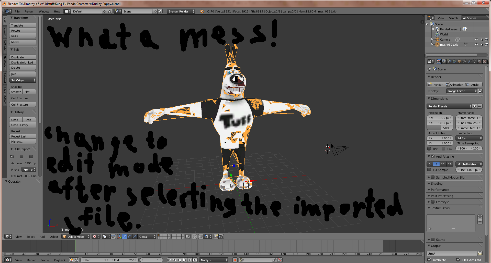
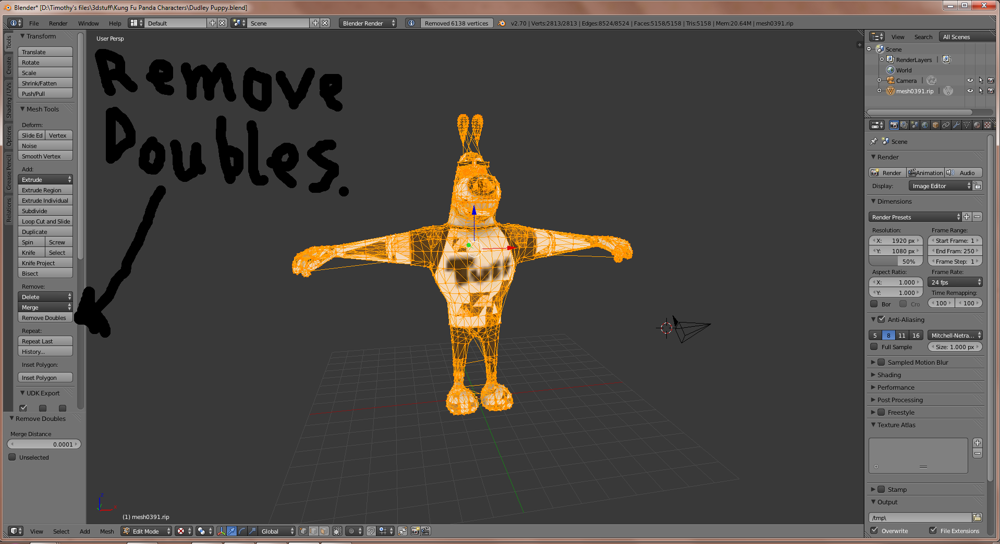
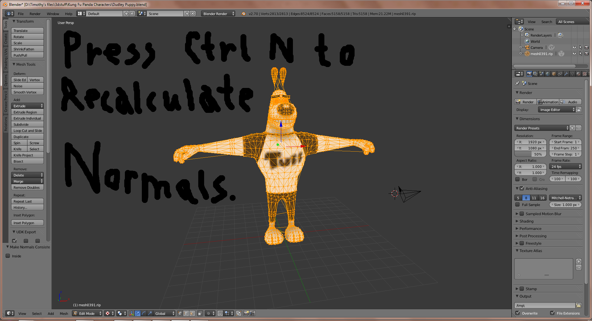
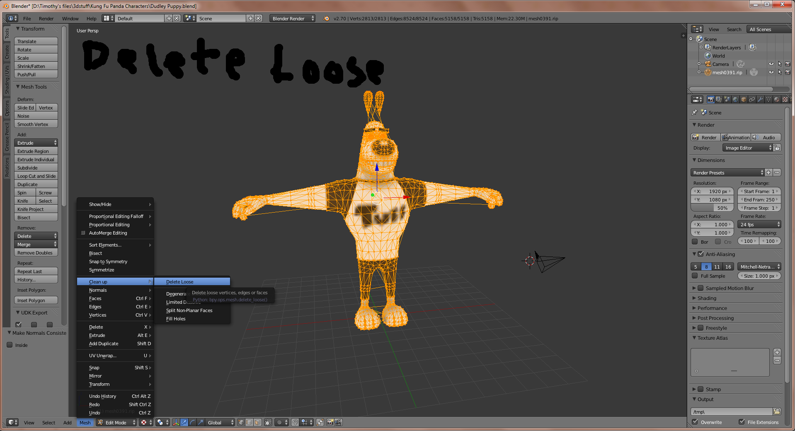
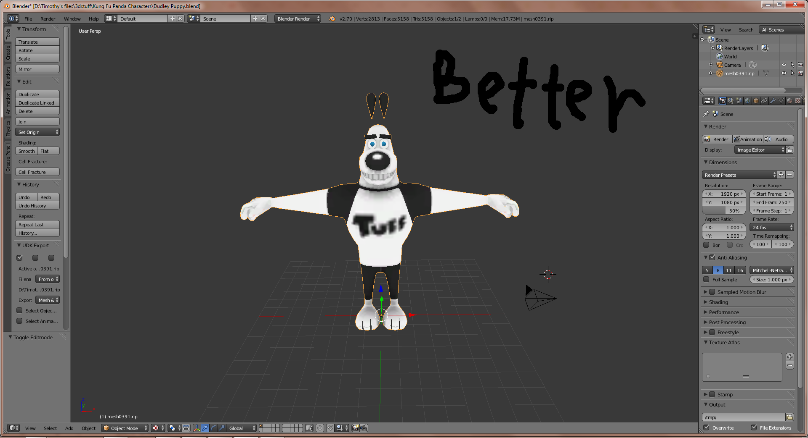

I doubt I'm the only one who is has encountered this problem, but for those who want to know how to fix it, I am here to help. Let's take a look at what we are talking about in Blender:

The first step is to select the mesh and go into edit mode. The next photo will show you what you need to do next.

Now that we are in edit mode, let's make sure all vertices are selected and remove doubles. If only some of them are selected, press the A key twice to unselect and reselect everything. Once the doubles are removed, we'll be able to go to the next step: Recalculating the normals.

 

There are several ways to do this, but I recommend pressing CTRL and N. You could also click on the Shading/UVs tab and recalculate them from there or go to mesh menu and select normals, then recalculate outside to do the same thing. We still the odds lines to deal with though.

  

Click where it says Mesh, go to Clean up, then click Delete Loose. This should solve the issue with loose dots and lines. If done correctly, your ripped model should end up looking more like this.

I hope this helps people. If you have any thing you'd like to say, any questions you want to ask, or want to show off any work this helped you with, please feel free to do so.