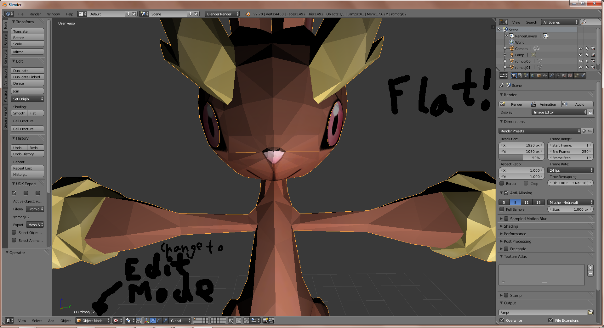
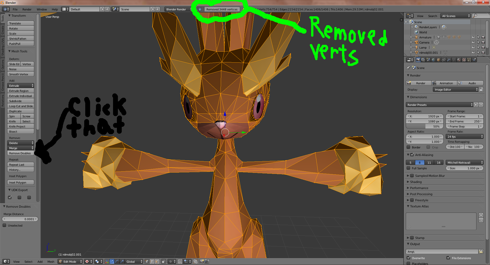
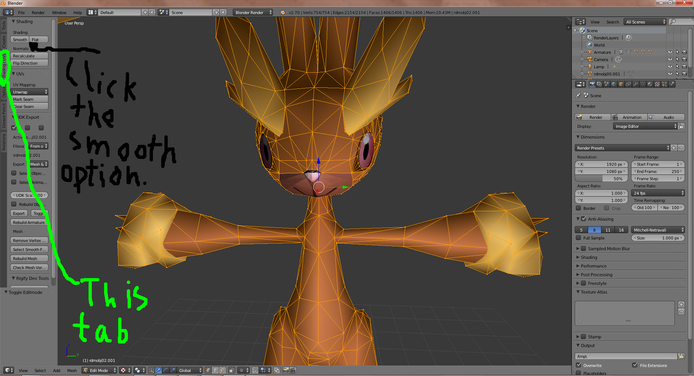
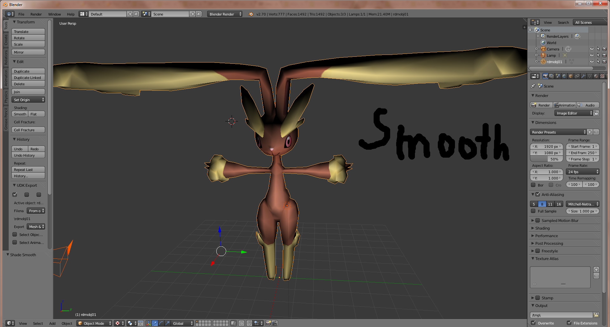

# Smooth shading with Blender tutorial

I have seen a number of models on the model resource that could use some work in regards to smooth shading. Applying smooth shading doesn't work as well as it should. But there is a solution. For this tutorial, I will be using the Lopunny Model from Random Talking Bush and Mighty Jetters to make it look fluffier. I will also be using Blender 2.70 for this tutorial.

Before we begin, I would like to warn people that I have seen this cause some issues on some models I have experimented on, so it is a good idea to keep a back up of your model around just to be safe.

First off, load your model into Blender. You might see it as a white object. Don't worry too much about the lack of color. The concern of this tutorial is the sharp edges. Start by selecting a flat object. Look for where it says object mode at the bottom of the 3d view window. Change that to edit mode.

With all vertices of the model you want to smooth selected, you should be ready to take on this next part. If they are not selected press the A key until everything is (usually once or twice). In the tools tab on the left side of the window, click Remove Doubles. You'll get a notices about removed vertices. This is a sign you did it right.

This next part is where we finally make Lopunny fluffier. With all remaining vertices selected, click the Shading/UVs tab. Now click smooth.

You'll notice the selected (yellow) portion should look smoother now if you followed the steps in order. If you had skipped the previous step in hopes of making your model look smoother faster, you might not have gotten the results you wanted. Go back and do step 2, that should fix it.

With a little effort and experimenting with blender, it is possible to get Lopunny and other meshes to look more like this:

  

If you find this tutorial useful, I have finished another one that involves meshes with random holes and lines in them next. Feel free to leave comments, ask questions, and show off what this tutorial has helped you with.